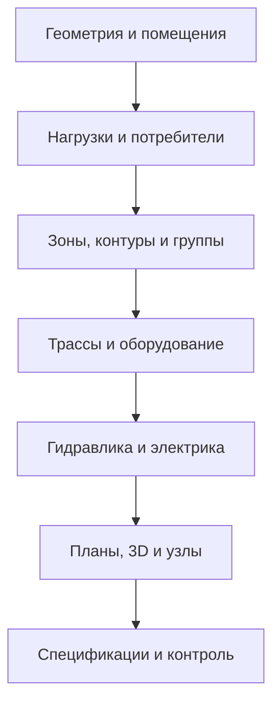

# HomeAura — справочник логики по 10 инженерным проектам

Дата анализа: 27.07.2026

## 1. Назначение

Этот документ фиксирует полезную логику построения инженерных проектов,
выявленную при сравнении десяти референсных PDF-альбомов. Материал предназначен
для разработки HomeAuraEngineeringAgent и последующего формирования собственных
проектов HomeAura в вариантах «Бюджет», «Комфорт» и «Премиум».

Референсы используются:

- как ориентир по полноте рабочего альбома;
- как набор повторяющихся проектных сценариев;
- как источник идей для структуры данных, проверок и генерации листов;
- как примеры связи планов, 3D, расчётов, узлов и спецификаций.

Референсы не используются:

- как нормативная база без отдельной проверки актуальности СП, ГОСТ и ПУЭ;
- как источник для копирования графического оформления, логотипов и штампов;
- как универсальные типовые решения без проверки исходных данных объекта;
- как готовая спецификация для другого дома или другого региона.

## 2. Изученный корпус

Всего изучено 10 PDF, 505 листов. Все альбомы выполнены преимущественно на A3.

| Файл | Объект | Площадь | Листов | Основное содержание |
|---|---:|---:|---:|---|
| 2026-2219R-МЕР.pdf | Квартира, Москва | 80 м² | 36 | Сводные сети, водоснабжение, канализация, радиаторное отопление |
| 2026-319-MEP.pdf | Жилой дом, Нижегородская область | 103 м² | 43 | Водоснабжение, отопление, тёплый пол, котельная |
| 2026-2203R-МЕР.pdf | Жилой дом, Волгоградская область | 147 м² | 47 | Водоснабжение, отопление, тёплый пол, котельная |
| 2026-2232R-МЕР.pdf | Жилой дом, Республика Коми | 100 м² | 52 | Водоснабжение, канализация, отопление, тёплый пол, котельная |
| 2026-2176R-MEP.pdf | Жилой дом, Московская область | 244 м² | 60 | Несколько этажей, водоснабжение, отопление, тёплый пол, котельная |
| 2026-2245R-МЕР.pdf | Жилой дом, Минская область | 156 м² | 48 | Водоснабжение, отопление, тёплый пол, котельная |
| 2026-2159R МЕР .pdf | Жилой дом, Московская область | 229 м² | 69 | Несколько этажей, водоснабжение, канализация, отопление, котельная |
| 2026-2230R МЕР.pdf | Жилой дом, Самарская область | 117 м² | 63 | Несколько этажей, водоснабжение, канализация, отопление, котельная |
| электрика_GalfDesign.pdf | Жилой дом | 146,87 м² | 26 | Розетки, освещение, выключатели, группы, щит, автоматика, спецификация |
| 2026-162-МЕР.pdf | Жилой дом, Омская область | 295 м² | 61 | Крупный многоэтажный объект, все основные гидравлические разделы и котельная |

Диапазон объектов — от квартиры 80 м² до дома 295 м². Это позволяет отделить
устойчивую структуру проекта от решений, которые меняются из-за площади,
этажности, климата, источника тепла и состава оборудования.

## 3. Устойчивый каркас полного проекта

В девяти MEP-альбомах повторяется следующая последовательность:

1. Титульный лист.
2. Сводные 3D-виды инженерных сетей или ключевых узлов.
3. Сводный план сетей по каждому этажу.
4. Экспликация помещений с площадями, расчётными температурами и нагрузками.
5. Расчёт теплопотерь по помещениям и ограждающим конструкциям.
6. Раздел водоснабжения:
   - общие данные;
   - план ХВС, ГВС и рециркуляции;
   - 3D-вид;
   - узел ввода и водоподготовка;
   - коллекторы;
   - деталировка;
   - спецификации.
7. Раздел канализации, если он входит в задание:
   - общие данные;
   - планы;
   - 3D или аксонометрия;
   - выпуски, стояки, трапы и ревизии;
   - спецификации.
8. Раздел отопления:
   - общие данные;
   - радиаторы или внутрипольные конвекторы;
   - подача и обратка;
   - коллекторы;
   - узлы подключения;
   - спецификации.
9. Раздел водяного тёплого пола:
   - планы раскладки по этажам;
   - номера и длины контуров;
   - шаг укладки;
   - краевые зоны;
   - транзитные участки;
   - коллекторы;
   - таблицы контуров и гидравлики;
   - расходные материалы.
10. Раздел котельной:
    - общие данные;
    - принципиальная схема;
    - компоновочные виды;
    - 3D;
    - размеры;
    - подробная обвязка каждого узла;
    - спецификация оборудования, труб и фитингов.

Электрический альбом дополняет каркас:

1. Общие данные и условные обозначения.
2. План розеточной сети с группами и трассами.
3. 3D-вид розеточной сети.
4. План осветительной сети.
5. План привязок светильников.
6. План выключателей и линий управления.
7. Сводный план электропроводки.
8. Схема дополнительной автоматики помещений.
9. Однолинейная схема щита.
10. Расчётная таблица нагрузок и аппаратов защиты.
11. Уравнивание потенциалов и заземление.
12. Кабельный журнал и спецификация.

## 4. Главная логика, которую нужно перенести в HomeAura

Проект должен строиться не от чертежа, а от единой проверяемой модели данных:

Один и тот же объект должен порождать все связанные представления. Например,
контур тёплого пола существует один раз в модели, но отображается:

- на плане;
- в таблице контуров;
- на коллекторе;
- в гидравлическом расчёте;
- в спецификации трубы и расходных материалов;
- в 3D;
- в перечне автоматики зоны.

Изменение длины, диаметра, коллектора или помещения должно автоматически
обновлять все эти представления.

## 5. Логика по помещениям и теплопотерям

### Входные данные

Для каждого помещения нужны:

- уникальный ID и номер;
- этаж;
- наименование;
- площадь, периметр и высота;
- расчётная температура;
- наружные и внутренние ограждения;
- окна и двери с размерами;
- составы стен, пола, перекрытия и кровли;
- ориентация наружных поверхностей;
- климатический район и наружная расчётная температура;
- зоны, где прокладка инженерных систем запрещена.

### Расчётная цепочка

1. Выделить ограждающие конструкции помещения.
2. Вычесть проёмы из площади стен.
3. Рассчитать потери через стены, окна, двери, пол и перекрытие.
4. Учесть температурные коэффициенты и запас только по принятой методике.
5. Свести нагрузку помещения.
6. Сопоставить нагрузку с возможной теплоотдачей тёплого пола.
7. Недостающую мощность закрыть радиатором, конвектором или другим прибором.
8. Передать нагрузку в расчёт источника тепла и котельной.

### Контроль

- сумма нагрузок помещений должна совпадать с итогом по этажу и дому;
- помещение без нагрузки должно иметь объяснимую причину;
- окно или наружная стена не должны потеряться при изменении Boundary;
- расчётная температура должна зависеть от назначения помещения;
- исходные коэффициенты должны быть видны в отчёте, а не скрыты внутри агента.

## 6. Водоснабжение

### Наблюдаемая логика

- коллекторная разводка к потребителям;
- отдельные линии ХВС, ГВС и при необходимости рециркуляции;
- исключение соединений внутри стяжки;
- теплоизоляция труб;
- узел ввода с запорной арматурой, фильтрацией, редуктором, обратным клапаном,
  манометром и защитой от протечек;
- водоподготовка формируется по исходному анализу воды, а не только по шаблону;
- отдельные решения для бойлера, проточного нагревателя, гигиенического душа,
  незамерзающих кранов и компенсации гидроударов;
- водорозетки и высотные привязки должны быть связаны с сантехническим заданием.

### Алгоритм HomeAura

1. Собрать всех потребителей и их требования.
2. Определить одновременный расход.
3. Выбрать схему — коллекторную, тройниковую или комбинированную.
4. Определить место ввода, водоподготовки и коллекторов.
5. Построить маршруты с учётом конструкций, сервисных зон и пересечений.
6. Назначить диаметры по расходу, скорости и потерям давления.
7. Проверить доступность арматуры и фильтров для обслуживания.
8. Сформировать узел ввода, планы, 3D, деталировки и спецификацию из одной модели.

### Обязательные проверки

- отсутствие скрытых неразъёмных/разъёмных соединений, не разрешённых принятой системой;
- достаточное давление в наиболее неблагоприятной точке;
- отсутствие тупиков ГВС с чрезмерным ожиданием горячей воды;
- корректная рециркуляция;
- защита от обратного потока;
- защита от протечки;
- ремонтопригодность фильтров и коллекторов;
- совместимость материалов, резьб и соединительных систем.

## 7. Канализация

### Наблюдаемая логика

- приборы привязаны к выпускам, стоякам и фановой части;
- маршруты строятся с уклонами;
- диаметры зависят от типа прибора и объединённого расхода;
- используются ревизии, прочистки, трапы и аварийные сливы;
- на планах должны быть отметки, направления уклона и диаметры;
- 3D особенно полезен для проверки пересечений и высот.

### Алгоритм HomeAura

1. Определить точки подключения приборов.
2. Назначить диаметры выпусков.
3. Выбрать стояки и выходы из здания.
4. Построить самотечные маршруты от дальних приборов к стоякам.
5. Проверить уклоны, высотный запас пола и пересечения.
6. Добавить ревизии и доступ к прочистке.
7. Проверить вентиляцию канализации и защиту гидрозатворов.
8. Выпустить планы, аксонометрию/3D и спецификацию.

## 8. Радиаторное отопление

### Наблюдаемая логика

- сначала определяется нагрузка помещения;
- затем выбирается тип прибора и его мощность;
- прибор получает подающую и обратную линии;
- несколько этажей разделяются по коллекторам;
- узлы подключения показываются отдельно;
- применяются термостатические и балансировочные элементы;
- спецификация должна быть связана с фактическим количеством приборов и узлов.

### Проверки HomeAura

- мощность при расчётном температурном графике, а не только по каталожному номиналу;
- расположение прибора относительно окон, мебели и дверей;
- доступ к воздухоотводчику и запорной арматуре;
- балансировка ветвей;
- допустимые скорости и потери давления;
- соответствие расхода прибора нагрузке помещения.

## 9. Водяной тёплый пол

Это наиболее ценный раздел для обучения логике автоматического построения.

### Наблюдаемые объекты данных

- зона помещения;
- контур;
- коллектор;
- подающий и обратный транзит;
- шаг укладки;
- краевая зона;
- длина трубы;
- обслуживаемая площадь;
- тепловая мощность;
- расход;
- потеря давления;
- сервопривод;
- комнатный термостат.

### Алгоритм построения

1. Получить чистую отапливаемую площадь.
2. Исключить стационарную мебель, лестницы, оборудование и запрещённые зоны.
3. Определить требуемую удельную теплоотдачу.
4. Выбрать базовый шаг и необходимость краевой зоны.
5. Разделить площадь на контуры с близкими длинами.
6. Назначить коллектор и пути подачи/обратки.
7. Изолировать транзитные участки там, где лишняя теплоотдача недопустима.
8. Построить петлю без недопустимых радиусов и пересечений.
9. Рассчитать фактическую длину, расход и потерю давления.
10. Проверить балансируемость коллектора.
11. Связать контуры одного помещения с одной зоной управления, если это
    соответствует выбранной автоматике.

### Контрольные правила

- длина считается по фактической геометрии, а не по площади и коэффициенту;
- максимальная длина задаётся системой трубы и допустимой гидравликой;
- длины контуров одного коллектора не должны отличаться без обоснования;
- дверь и деформационный шов требуют отдельного решения;
- один контур не должен случайно объединять помещения с разными режимами;
- таблица контуров обязана совпадать с планом и коллектором;
- число выходов коллектора должно учитывать резерв по выбранному уровню проекта;
- мощность пола проверяется по температуре поверхности и типу покрытия.

## 10. Котельная

### Сильные стороны референсов

- принципиальная схема показывает связь источников и потребителей;
- цветом разделены трубопроводные системы;
- есть резервные источники: например, газовый и электрический котлы;
- показаны насосы, коллекторы, расширительные баки, бойлер, группы безопасности;
- компоновка сопровождается размерами;
- отдельные листы детализируют фитинги и арматуру;
- итоговая спецификация формируется до уровня отдельных соединителей.

### Правильная логика HomeAura

1. Получить тепловые нагрузки отопления, вентиляции и ГВС.
2. Выбрать источники и схему резервирования.
3. Разделить потребителей по температурным графикам.
4. Определить необходимость гидравлического разделения.
5. Рассчитать насосы и диаметры.
6. Назначить расширительные баки и группы безопасности.
7. Построить принципиальную схему.
8. Выполнить пространственную компоновку с сервисными зонами.
9. Проверить монтаж, демонтаж и обслуживание каждого элемента.
10. Сгенерировать деталировки и спецификацию из фактической 3D-компоновки.

### Проверки

- источник покрывает расчётную нагрузку с обоснованным резервом;
- насосы работают в своей рабочей области;
- контуры с разными температурами разделены корректно;
- расширительные баки рассчитаны по объёму системы;
- группа безопасности не отделена запорной арматурой от защищаемого оборудования;
- есть слив, подпитка, воздухоудаление и удаление шлама;
- сохранены минимальные сервисные расстояния;
- расположение дымохода, газа и электрики проверяется отдельными правилами.

## 11. Электрика и автоматика

### Наблюдаемая логика

- розетки, светильники и выключатели сначала существуют как конечные устройства;
- устройства объединяются в группы;
- выключатели связаны с конкретными светильниками линиями управления;
- трассы групп приходят к щиту;
- щит содержит аппараты защиты и расчётные нагрузки;
- кабельный журнал и спецификация являются производными от групп и трасс;
- 3D помогает проверить высоты и пространственную координацию.

### Модель HomeAura

Для каждого устройства:

- тип;
- помещение;
- координата и высота;
- мощность;
- фаза;
- группа;
- сценарий управления;
- кабель;
- способ прокладки;
- защита;
- потребитель/контроллер, с которым устройство связано.

### Проверки

- мощность и ток группы;
- сечение кабеля и допустимая потеря напряжения;
- автомат, УЗО/дифзащита и селективность;
- разделение силовых и слаботочных трасс;
- специальные зоны в санузлах;
- уравнивание потенциалов и заземление;
- резерв модулей щита;
- читаемая связь «выключатель — светильник — сценарий»;
- отдельные группы для критичных и мощных потребителей.

Электрический референс 2023 года можно использовать для структуры листов и
логики связей, но нормативные решения необходимо проверять по актуальным
требованиям на дату выпуска проекта.

## 12. Что должно быть лучше в HomeAura

В референсах встречаются:

- мелкий текст и высокая плотность подписей;
- большие пустые зоны на отдельных спецификациях;
- повторение одних и тех же общих данных;
- смешение проектной логики с конкретными брендами;
- недостаточно явная связь номера элемента на 3D со строкой спецификации;
- отсутствие полного раздела вентиляции;
- отсутствие общего отчёта по коллизиям;
- отсутствие наглядного сравнения вариантов стоимости;
- отсутствие понятного заказчику резюме;
- ограниченная информация о пусконаладке и контрольных замерах.

HomeAura должна добавить:

- отдельный альбом выбора «Бюджет / Комфорт / Премиум»;
- собственную графическую систему и штамп;
- QR-ссылку на 3D и актуальную версию проекта;
- кликабельную связь узлов и спецификации в цифровой версии;
- автоматический журнал коллизий и нормативных предупреждений;
- монтажные контрольные точки;
- лист пусконаладки и балансировки;
- контроль фактических параметров после монтажа;
- оценку стоимости и эксплуатационных расходов;
- вентиляцию, автоматику и межсистемную координацию.

## 13. Разделение трёх бюджетов

Геометрия, расчётные нагрузки и требования безопасности не должны ухудшаться
в бюджетной версии. Разница должна быть в оборудовании, резервировании,
автоматике, ремонтопригодности и комфорте.

| Решение | Бюджет | Комфорт | Премиум |
|---|---|---|---|
| Разводка воды | Надёжная базовая | Коллекторная, защита от протечек | Расширенная водоподготовка, мониторинг |
| ГВС | Базовый источник | Бойлер/рециркуляция по необходимости | Быстрая рециркуляция, контроль качества и энергии |
| Отопление | Минимально достаточное | Зональное регулирование | Полная автоматика и резервирование |
| Тёплый пол | Ручная балансировка | Комнатные термостаты и сервоприводы | Интеграция, аналитика, удалённые сценарии |
| Котельная | Один основной источник | Резерв критичных функций | Каскад/резерв, мониторинг и расширенная диагностика |
| Электрика | Нормативный минимум и резерв | Раздельные группы, удобная автоматика | Энергомониторинг, сценарии, интеграция |
| Документация | Полный безопасный рабочий проект | Дополнительные узлы и настройка | Цифровой двойник, расширенная эксплуатационная модель |

## 14. Предлагаемые сущности данных агента

Минимальный набор:

- Project;
- Building;
- Level;
- Room;
- Boundary;
- ConstructionAssembly;
- Opening;
- DesignCondition;
- HeatLossItem;
- Fixture;
- WaterDemand;
- DrainConnection;
- HeatingEmitter;
- FloorHeatingZone;
- FloorHeatingLoop;
- Manifold;
- PipeSegment;
- Fitting;
- Valve;
- Pump;
- HeatSource;
- StorageTank;
- ExpansionVessel;
- ElectricalDevice;
- Circuit;
- CableRoute;
- ProtectionDevice;
- ControlScenario;
- SpecificationItem;
- DrawingView;
- ValidationIssue.

Каждая сущность должна иметь стабильный ID, источник данных, статус проверки и
ссылки на связанные объекты. Это позволит обновлять проект без потери ручных
корректировок.

## 15. Порядок генерации проекта агентом

1. Импортировать геометрию здания.
2. Найти и подтвердить помещения.
3. Запросить только недостающие исходные данные.
4. Выполнить теплотехническую модель.
5. Сформировать три концептуальных варианта.
6. Проверить принципиальную совместимость систем.
7. После выбора варианта построить трассы.
8. Выполнить гидравлические и электрические расчёты.
9. Разместить оборудование и проверить сервисные зоны.
10. Выполнить координацию и коллизии.
11. Сгенерировать планы, 3D, схемы и узлы.
12. Сгенерировать спецификации из модели.
13. Провести автоматический QA.
14. Выпустить альбом выбора или рабочий альбом.

## 16. Правила качества

Агент не должен:

- скрывать допущения;
- выдавать непроверенное решение как готовое;
- копировать чужое оформление;
- использовать бренд как единственно возможное решение;
- считать спецификацию отдельно от модели;
- изменять Boundary без фиксации источника и версии;
- автоматически устранять неоднозначность помещения без отчёта;
- подменять нормативный расчёт эвристикой.

Агент должен:

- показывать происхождение ключевых чисел;
- разделять рассчитанное, выбранное и требующее подтверждения;
- сохранять историю решений;
- обеспечивать двустороннюю связь модели и документации;
- выпускать список предупреждений;
- иметь ручную точку подтверждения перед рабочей документацией.

## 17. Капсула памяти для следующих этапов HomeAura

Десять проектов приняты как референсный корпус HomeAura:

- 9 MEP-альбомов и 1 электрический альбом;
- 505 листов A3;
- объекты 80–295 м²;
- главный ориентир — связь расчётов, планов, 3D, узлов и спецификаций;
- особенно полезны логика тёплого пола, коллекторов, котельной и электрических групп;
- проекты являются источником паттернов, но не нормативной базой;
- HomeAura должна иметь своё оформление и более сильные QA, вентиляцию,
  автоматику, пусконаладку и сравнение бюджетов.

При дальнейшей разработке решения следует сверять с этим справочником, если
этап касается:

- состава рабочего альбома;
- структуры данных инженерной модели;
- автоматической трассировки;
- тёплого пола;
- водоснабжения и канализации;
- отопления и котельной;
- электрики и автоматики;
- спецификаций;
- проверки полноты проекта.
