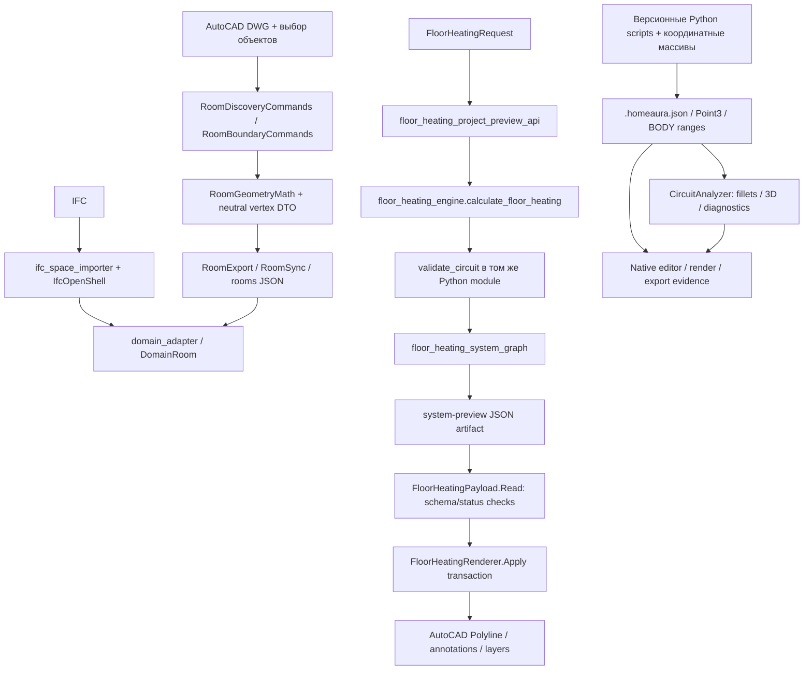

# HomeAura: технический и архитектурный аудит

## Текущий результат R3 — M1a / ограниченный M1b / M2 preflight

**Для малого синтетического rectangle выбран BUILD.** Ручной бифилярный эталон проходит независимый checker в явно ограниченной грамматике прямых и BOX-зон переходов. Исходные концы и численные пределы M1a не изменены. 17 тестов checker и 5 тестов шаблона прошли; поддержанная высота3000 мм, ширина4000..5000 мм, p200/Rmin80, фактический R100. Каждый кандидат проверяется, export всегда false. Не считать этот результат owner max-gap200 или постоянным offset200 на всех дугах.

У UFH Designer сохранены реальные параметры23 дуг без изменения исходных точек. Прямая замена и выбранная попытка терминального адаптера не прошли контракт; последняя наложила обратку на существующий проход. Это не доказательство невозможности иных адаптаций. Полный результат и границы: [M1a/M1b](HOMEAURA_M1A_M1B_RESULT.md).

Начат [M2 preflight](HOMEAURA_M2_PREFLIGHT.md): max200 достигнут отдельным физическим вариантом, но с недопустимыми для прежнего контракта20-мм участками; вариант не принят. Изолированный p100/R80 разворот из3 дуг проверен с точным free-space envelope. M2 целиком не закрыт. Claude review не состоялся из-за expired OAuth; production/CAD не менялись.

Предыдущие состояния R2 и первоначальные рекомендации ниже сохранены как история; при расхождении текущий статус задают эти два отчёта.

## Историческое состояние R2 — 9 сентября 2026

Текущий порядок: воспроизводимый контракт → независимый checker → benchmark UFH Designer → решение ADAPT/BUILD → один p200/R80 шаблон при необходимости → интеграция. Архитектура ниже является целевой, а не объёмом первого эксперимента. M1a и M1b разделены; 100/200 и C05/C06 относятся к M2.

UFH Designer закреплён на `bafc690f340943f6e04f9bf9a34b2c1e268d39e0` (Apache-2.0). Выполнен изолированный прогон: прямой выход не проходит фиксированные концы, направления и геометрическое покрытие. Upstream: 76/81 tests passed. **ADAPT/BUILD пока не установлен: checker не проверяет бифилярную морфологию, шаг и полный OD-clearance.** Ручная змейка проходит лишь реализованный геометрический набор; все шесть мутаций отклонены. Это не положительный solver fixture. Подробности и воспроизведение: [M1a benchmark](HOMEAURA_M1A_UFH_DESIGNER_BENCHMARK.md).

Уточнения обязательны для чтения остальной спецификации:

- `ProvenInfeasible` требует проверяемого необходимого условия либо исчерпания **полной явно заявленной модели**. Исчерпание каталога шаблонов даёт `NoFeasibleCandidateFound`/`Unsupported`.
- Любая обязательная проверка `Indeterminate` даёт общий `ValidationIndeterminate` и `export_allowed=false`; известный Fail сохраняет общий Fail. PASS требует Pass всех обязательных правил.
- RECT-01: 4000×3000 мм, p200/R80, OD16, surface wall clearance80, length≤80 м; до запуска фиксируются два BODY-конца и касательные. Геометрическое покрытие радиусом250 мм ≥99%, максимум расстояния до оси ≤250 мм. Отдельно обязательны шаг по самой кривой и even-in/odd-out с единственным центральным соединением. Это синтетические диагностические пороги, не теплотехнический расчёт; Valid golden пока отсутствует.
- holes=Unsupported у генератора не отменяет obstacle-negative тестов checker. p100 с прямой полуокружностью означает R50; иная топология при R80 требует построения и проверки реального свободного места, а не обещания «двух поворотов».
- Digest проверяет соответствие байтам/данным, не подлинность или инженерную истинность. На границе экспорта нужна независимая геометрическая проверка.
- Экономия 40–65% не измерена. Source hashes не заменяют snapshot содержимого незакоммиченного HomeAura. Приложенный архив UFH восстанавливает только закреплённый внешний эксперимент; полный M0 snapshot остаётся отдельной работой.

## Вывод

**Рекомендация: сохранить CAD/BIM adapters, накопленные инженерные правила, проектные данные и отрицательные регрессии; заменить геометрические примитивы библиотеками; построить небольшой независимый Floor Engine с обязательной проверкой перед экспортом.** Переписывать всю систему не требуется. Продолжать накопление координатных сценариев и попыток LLM вместо параметрического solver — неэффективно.

Главная проблема текущего решения — несколько конкурирующих определений геометрии и «корректного результата». Python engine проверяет острые ломаные и выборочные spacing evidence; native editor материализует изгибы, проверяет 3D clearance и различает степени готовности. Между ними нет единого проверяемого инженерного контракта. Это существенный архитектурный долг, а не косметический недостаток классов.

Готового проверенного компонента, который закрывает 70–90% совокупности требований HomeAura, исследование не установило. Clipper2/NTS снимают значительную часть низкоуровневой геометрии. Сшивка, доступность концов, variable spacing, радиусы, межконтурная совместимость и физические подключения остаются отдельной инженерной задачей.

## Основание и границы

FACT: исследована рабочая копия `C:\AI\HomeAuraEngineeringAgent`, ветка `feature/room-geometry`, HEAD `9e86e06`. Рабочая копия содержит множество изменённых и незарегистрированных файлов; HEAD сам по себе не воспроизводит текущее состояние. Сохранённый в приложении проект `C:\Users\zahar\OneDrive\Документы\HomeAura` пуст: нет исходников, коммитов и remote. Обнаружены связанные worktrees `HomeAura-Codex-Contracts` и `HomeAura-Codex-Orchestration` на `c11205f`; они не объявляются актуальным продуктом.

Инвентаризация `rg --files --hidden` с исключением `.git`, `node_modules`, `bin`, `obj` охватила 3 871 путь; прочитаны и хешированы 608 файлов исходников/build-конфигураций. Их 189 443 строки **включают временные сторонние Python-библиотеки**, поэтому это не размер собственного кода. Инвентаризация всех путей не означает построчную экспертизу каждого из них. Детальный анализ выполнен для CAD → DTO, Python UFH, native geometry/validation, генераторов C05/C06, тестовых harness и IFC seam. Все DWG/PDF, временные внешние AI-ответы и исторические пакеты не открывались и не исполнялись. Не доказаны отсутствие dead code и полнота покрытия всех возможных runtime-ветвей.

В `evidence/` приложены инвентаризация, import edges, воспроизводимый контрпример и извлечённые исторические координаты C05/C06. Разделение утверждений: **FACT** — исходник/запуск/первичный источник; **HYPOTHESIS** — требует эксперимента; **RECOMMENDATION** — предлагаемое решение. Это архитектурный аудит данного snapshot, не сертификация инженерной или нормативной готовности продукта.

## Все обнаруженные solution/project

| Файл | Runtime и назначение | Фактическая зависимость |
|---|---|---|
| `autocad-plugin/HomeAura.AutoCAD.Agent/HomeAura.AutoCAD.Agent.sln` | Единственный найденный solution этой копии | AutoCAD plugin |
| `autocad-plugin/HomeAura.AutoCAD.Agent/HomeAura.AutoCAD.Agent/HomeAura.AutoCAD.Agent.csproj` | .NET Framework 4.8, C# 7.3 в x64-конфигурациях | accoremgd/acdbmgd/acmgd; System.Net.Http |
| `tests/room_geometry/RoomGeometry.Tests.csproj` | .NET Framework 4.8, console Exe | Linked Compile исходников plugin; без Autodesk references |
| `homeaura-native-editor/HomeAura.NativeEditor.csproj` | net9.0-windows, WinExe, Windows Forms | Модель, анализатор и UI в одной сборке |
| `homeaura-native-editor-tests/HomeAura.NativeEditor.Tests.csproj` | net9.0-windows, console Exe | ProjectReference на Windows Forms editor |
| `homeaura-native-editor-generate/HomeAura.NativeEditor.Generate.csproj` | net9.0-windows, console Exe | ProjectReference на editor |

Дополнительно: `agent/` — FastAPI/Pydantic/Python; `homeaura-editor/` — React/TypeScript, vinext/Vite, Drizzle, web preview. `requirements.in` содержит openai/openai-agents, но наличие пакета не доказывает вызов AI внутри расчётного потока. `agent/main.py` — только стартовое сообщение, не автономный инженерный агент.

Размеры по инвентаризированным source/build files (физические строки, включая комментарии): agent — 41 файл / 14 330 строк; AutoCAD plugin — 26 / 11 603; native editor — 7 / 6 828; native generators — 183 / 44 333; Python/net48 tests — 34 / 16 194; native tests — 38 / 11 879; web editor — 18 / 943. Это описательные размеры областей, не оценки удаляемого кода. Временные зависимости не входят в эти семь строк.

## Фактические потоки данных

FACT: обнаружение комнаты не является доказанным полностью автоматическим DWG understanding. `RoomDiscoveryCommands.cs:23–60` запрашивает выбор маркера, контура и связанных объектов. `RoomBoundaryCommands` переводит Autodesk entities в данные `RoomGeometryMath`; математический seam уже существует. Не найдено основания изображать стрелку DomainRoom → UFH request как полностью автоматизированный завершённый конвейер: preview получает самостоятельный `FloorHeatingRequest`.

FACT: `/system-preview` (`agent/floor_heating_project_preview_api.py`) валидирует request, вызывает `calculate_floor_heating`, затем `build_floor_heating_project_preview`. `FloorHeatingCommands` читает файл результата, `FloorHeatingPayload` требует ожидаемые поля/status/digests, renderer создаёт entities в транзакции. Это полезная fail-closed защита формата, **но не независимое повторное доказательство физической трассы**.

FACT: native editor — параллельная ветка. `build_floor1_boiler_pair_178.py` импортирует вспомогательные функции из D175/D176/D177, изменяет исторический JSON, запускает native editor через subprocess и формирует пакет. Это зависимость вычислений от цепочки проектных ревизий, а не только архив.

FACT: web `app/api/floor-heating/coverage-preview/route.ts` проксирует запрос в loopback FastAPI `/api/v1/engineering/floor-heating/coverage-preview`; `lib/floor-heating-contract.ts` повторяет часть DTO. В просмотренном route web не генерирует координаты самостоятельно. Его local-only upstream необходимо учитывать при любом отдельном hosting deployment.

## Dependency graph и связанность

| Потребитель | Зависит от | Архитектурное следствие |
|---|---|---|
| `agent/api.py` | rooms, IFC, domain, UFH, coverage, storage routers | Приемлемый composition root; не переносить solver сюда |
| `floor_heating_sizing.py` | `floor_heating_coverage.py` | Тепловой расчёт связан с конкретным planner; выделить контракт между heat demand и layout |
| `floor_heating_coverage.py` | `floor_heating_engine.py`, domain/Pydantic | Разбиение уже имеется, но ограничено моделями и конкретной реализацией |
| `floor_heating_engine.py` | UFH DTO + собственные predicates | Generator и validator разделяют геометрические ошибки |
| `CircuitAnalyzer.cs` | `HomeAuraProject`, `ManualCircuit`, physical inputs | Богатая проверка, но модель/UI/runtime связаны сборкой |
| Native tests/generate | editor csproj | Можно без AutoCAD, но нельзя считать переносимым core |
| D178 generator | D175/D176/D177 helpers + Shapely + dotnet subprocess | Исторические сценарии становятся production-like библиотекой |
| RoomGeometry.Tests | linked plugin source files | Есть тестируемая математика; нет нормального library reference/test discovery |
| CAD renderer | Autodesk + payload | Правильное место для Autodesk зависимости |

## Приоритетные находки

### P1 — sampling допускает пересечение узкого препятствия

FACT: `agent/floor_heating_engine.py:194`, `_allowed_segment`, проверяет точки с `steps=max(1,length//100)`. Для outer `(0,0)…(1000,1000)`, отрезка `(100,500)→(900,500)` и прямоугольного hole `x=140..160,y=450..550` возвращает `True` при `wall_offset=0`. Отрезок заведомо пересекает hole. Контрпример выполнен в текущем окружении; это доказанный дефект helper, а не утверждение, что любой публичный request обязательно достигает этой ветви.

RECOMMENDATION: заменить на проверку всей кривой и физических envelope; добавить публичную регрессию на ближайшем поддерживаемом request. Файл `evidence/reproduce_sampling_gap.py` воспроизводит helper-дефект без CAD.

### P1 — spacing проверяется по переданным свидетельствам, не по полному маршруту

FACT: `validate_circuit`, строки около 995–1104, вычисляет дистанции между `spacing_segments` и требует присутствия 100 и 200. Он не устанавливает там принадлежность этих свидетельств реальной polyline и не восстанавливает полный набор соседних проходов. Чистый nominal-200 сценарий также не соответствует этому универсально названному validator. В сигнатуре отсутствует minimum bend radius.

RECOMMENDATION: validator восстанавливает соседство из финальной физической трассы и declared zones; evidence генератора — подсказка для диагностики, не источник истины. Разделить проверку spacing, local clearance, coverage и radius.

### P1 — специализированный template выглядит как общий counterflow solver

FACT: `_build_counterflow_geometry` требует field=200, perimeter=100, band_depth=1000, строит ровно четыре track bounds, использует пороги 1600/800 и фиксированные сдвиги connector. Функция полезна как узкий template, но не является доказанным параметрическим solver для произвольных размеров и фиксированных терминалов.

RECOMMENDATION: явно объявить область применимости; сохранить fixtures, заменить реализацию новым rectangle solver после shadow comparison.

### P1 — C05/C06 успешно зафиксированы тестом как исторический сценарий, но это не целевая улитка

FACT: D178 `c05_spec()`/`c06_spec()` содержат меандровые массивы и grammar `...VOID_FILL_SERPENTINE`. `BoilerPair178Validation.cs` закрепляет point digests, R80 и длины примерно 46.533 м / 45.434 м. Эти положительные проверки нельзя переименовать в доказательство bifilar morphology или точного Eurocone подключения. Более поздний compact packet отдельно фиксирует нерешённые finish-face/port-frame вопросы.

RECOMMENDATION: сохранить D178 как legacy replay; добавить новый independent golden с новой спецификацией. Историческая геометрия и требуемая новая геометрия — разные fixtures.

### P2 — единая точность отсутствует на уровне системы

FACT: Python UFH использует integer mm; IFC — метры и `1e-8/1e-6`; native analyzer — множество локальных `0.001`, `0.000001`, `.05`; model/editor — сетки 100/50. Разные величины могут требовать разных допусков: проблема не в самом различии чисел, а в отсутствии общего именованного бюджета ошибки и единиц.

RECOMMENDATION: PrecisionPolicy с отдельными coordinate, topology, approximation, engineering и survey допусками. Не заменять всё одним epsilon.

### P2 — дублируются predicates и модели

FACT: `_intersects` присутствует в engine, grid layout, SVG renderer, SVG certificate; point-in-polygon и distance также повторяются. Ещё варианты находятся в IFC importer, C# RoomGeometry и CircuitAnalyzer. DTO комнаты/границ представлены в rooms_api, domain_models, UFH models, IFC models, native ProjectModel. Часть DTO нужна для adapters; это не повод механически объединять все модели.

RECOMMENDATION: заменить 2D primitives на библиотеки, оставить явные adapter DTO и один канонический engineering model. Независимый checker должен иметь другую реализацию, но не ещё одну копию того же самописного predicate.

### P2 — концентрация обязанностей и исторических зависимостей

FACT: `CircuitAnalyzer.cs` — 3 402 строки, `ProjectModel.cs` — крупная модель с проверками; `floor_heating_engine.py` совмещает генерацию, маршрутизацию, validation и digest. Размер не доказывает God class сам по себе, но перечень методов analyzer включает materialization, topology, ports, physical-input readiness, wall/turn/surface checks и project completeness.

RECOMMENDATION: извлекать по обязанностям под существующими тестами, начиная с immutable geometry и materializer. Не делать универсальный framework заранее.

### P2 — AI участвует в координатном проектировании через внешний workflow

FACT: `reports/HomeAura_AI_coordination_policy_2026-08-20.md` распределяет topology/Point3 candidates между моделями; compact packet описывает `p0+runs` и «exact body arrays». Это подтверждение AI-generated geometry на уровне рабочего процесса. В просмотренном основном FastAPI→UFH пути вызов LLM не обнаружен: арифметика там детерминированная.

RECOMMENDATION: заменить внешние координатные задания на EngineeringIntent, выбор готового solver и интерпретацию машинных диагностик. Независимое обсуждение архитектуры полезно; количество согласившихся моделей не заменяет validator.

## KEEP / REFACTOR / REPLACE / REMOVE / EXPERIMENTAL

| Компонент | Решение | Причина и условие |
|---|---|---|
| AutoCAD transaction, ownership metadata, layers, contained output | KEEP | Полезная интеграция; усилить вход validated artifact |
| Room discovery и neutral RoomGeometry seam | REFACTOR | Сохранить извлечение/семантику, вынести predicates |
| Strict JSON/Pydantic, finite checks, identity/digests, atomic IO | KEEP | Воспроизводимость и fail-closed данные |
| IFC importer + domain adapter | KEEP/REFACTOR | IfcOpenShell уже предусмотрен; унифицировать units/provenance |
| Python low-level intersections/inside/boolean-like helpers | REPLACE | Clipper2/NTS либо временно Shapely; не поддерживать пять копий |
| Четырёхкольцевой Python counterflow | EXPERIMENTAL → REPLACE | Слишком узкая область параметров |
| Native CircuitAnalyzer | REFACTOR | Инженерные проверки ценны; выделить ядро и независимый checker |
| Native EditorCanvas/MainForm | KEEP | Инструмент просмотра/редактирования, не solver runtime |
| Версионные build_* D-сценарии | EXPERIMENTAL | Сохранить воспроизведение; прекратить импорт их как общей библиотеки |
| Старые VIS004–008/r2/r3 и координатные попытки | REMOVE из активного пути после доказательства отсутствия потребителей | Архивировать provenance, не удалять сейчас |
| SVG renderer/certificate geometry copies | REPLACE | Renderer отображает готовые line/arc DTO; checker отдельный |
| Coverage/sizing/install rules | REFACTOR | Сохранить предметную логику, разорвать зависимость от конкретного solver |
| Web editor | KEEP/DEFER expansion | UI не должен становиться третьим независимым solver |
| Exact-array LLM workflow | REMOVE из генерации production geometry | Перевести на tool orchestration |

Не обнаружено достаточных доказательств для массового удаления «недостижимых» файлов. Удаление требует import/call graph, runtime entrypoint inventory и replay пакетов, а не имени `tmp` или старой даты.

## Предлагаемая архитектура

См. `HOMEAURA_FLOOR_ENGINE_V2.md`. Исправление предложенной линейной схемы: **планирование подводки и резервирование входов выполняются до окончательной генерации BODY**, затем detailed routing и глобальная проверка. Иначе получаем красивую улитку с недоступными концами. Optimizer может выбирать только допустимые кандидаты; любое его изменение координат требует повторной проверки.

AutoCAD 2024 использует .NET Framework 4.8, что совпадает с текущим csproj. Не ссылаться из него напрямую на net9 Windows Forms core. Выбор: netstandard2.0 mathematical assembly для совместимых зависимостей либо отдельный versioned процесс современного .NET через DTO. Для MVP сначала проверить netstandard2.0 compatibility, не добавлять RPC без причины. [Autodesk compatibility](https://help.autodesk.com/cloudhelp/2024/ENU/AutoCAD-Customization/files/GUID-A6C680F2-DE2E-418A-A182-E4884073338A.htm).

## Экономия и настоящий moat

| Оценка | Confidence | Обоснование |
|---|---|---|
| Значительная доля собственного 2D predicate/offset кода заменима | HIGH для направления, не для объёма | Несколько найденных реализаций и прямое соответствие библиотекам |
| Сотни–первые тысячи строк низкоуровневой логики потенциально заменимы | LOW | До выделения библиотечных wrappers и удаления зависимостей точный net LOC неизвестен |
| Существенное сокращение активных исторических generator scripts | MEDIUM | Многие нужны для provenance/replay, не для продукта |
| Удалить фиксированный процент всего репозитория | Не оценено | В подсчёт попадают данные, временные зависимости, evidence и тесты |
| Ускорение Floor MVP | MEDIUM | Меньше primitive bugs, но connectors/100–200/R80 остаются сложными |

Уникальность HomeAura — проверенная инженерная модель здания, происхождение исходных данных, правила проектирования, согласование систем, допустимые шаблоны, реальная спецификация/документация и CAD/BIM workflow. Полилиния и polygon offset — инфраструктура. Самая трудная оставшаяся часть — совместное удовлетворение физических и топологических ограничений при неполных исходных данных, с честным объяснением отказа.

## Проверки этого аудита

`python -m pytest tests/test_floor_heating_engine.py tests/test_floor_heating_models.py tests/test_floor_heating_grid_layout.py -q -p no:cacheprovider`: **30 passed**.

`dotnet run --project homeaura-native-editor-tests/HomeAura.NativeEditor.Tests.csproj --no-restore`: **57/57 passed**. Это набор консольного harness, не 57 обнаруженных тестов `dotnet test`.

Контрпример sampling: пересечение hole пропущено. Новый solver не реализован, AutoCAD не запускался, DWG не менялись. Успех этих тестов не является проверкой всех исходников или готовности инженерного продукта.

## Следующее действие

Один эксперимент `FloorEngine.Experimental`: rectangle bifilar + независимый validator, затем 100/200, затем C05/C06 с честным blocked-input статусом. Не расширять на L/T до выполнения exit criteria. Детали, бюджет сложности и rollback — в migration plan.
