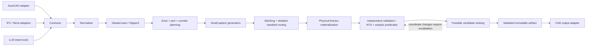

# HomeAura Floor Engine 2.0

## Текущий результат R3 — M1a / ограниченный M1b / M2 preflight

**Для малого синтетического rectangle выбран BUILD.** Ручной бифилярный эталон проходит независимый checker в явно ограниченной грамматике прямых и BOX-зон переходов. Исходные концы и численные пределы M1a не изменены. 17 тестов checker и 5 тестов шаблона прошли; поддержанная высота3000 мм, ширина4000..5000 мм, p200/Rmin80, фактический R100. Каждый кандидат проверяется, export всегда false. Не считать этот результат owner max-gap200 или постоянным offset200 на всех дугах.

У UFH Designer сохранены реальные параметры23 дуг без изменения исходных точек. Прямая замена и выбранная попытка терминального адаптера не прошли контракт; последняя наложила обратку на существующий проход. Это не доказательство невозможности иных адаптаций. Полный результат и границы: [M1a/M1b](HOMEAURA_M1A_M1B_RESULT.md).

Начат [M2 preflight](HOMEAURA_M2_PREFLIGHT.md): max200 достигнут отдельным физическим вариантом, но с недопустимыми для прежнего контракта20-мм участками; вариант не принят. Изолированный p100/R80 разворот из3 дуг проверен с точным free-space envelope. M2 целиком не закрыт. Claude review не состоялся из-за expired OAuth; production/CAD не менялись.

Предыдущие состояния R2 и первоначальные рекомендации ниже сохранены как история; при расхождении текущий статус задают эти два отчёта.

## Историческое состояние R2 — 9 сентября 2026

Текущий порядок: воспроизводимый контракт → независимый checker → benchmark UFH Designer → решение ADAPT/BUILD → один p200/R80 шаблон при необходимости → интеграция. Архитектура ниже является целевой, а не объёмом первого эксперимента. M1a и M1b разделены; 100/200 и C05/C06 относятся к M2.

UFH Designer закреплён на `bafc690f340943f6e04f9bf9a34b2c1e268d39e0` (Apache-2.0). Выполнен изолированный прогон: прямой выход не проходит фиксированные концы, направления и геометрическое покрытие. Upstream: 76/81 tests passed. **ADAPT/BUILD пока не установлен: checker не проверяет бифилярную морфологию, шаг и полный OD-clearance.** Ручная змейка проходит лишь реализованный геометрический набор; все шесть мутаций отклонены. Это не положительный solver fixture. Подробности и воспроизведение: [M1a benchmark](HOMEAURA_M1A_UFH_DESIGNER_BENCHMARK.md).

Уточнения обязательны для чтения остальной спецификации:

- `ProvenInfeasible` требует проверяемого необходимого условия либо исчерпания **полной явно заявленной модели**. Исчерпание каталога шаблонов даёт `NoFeasibleCandidateFound`/`Unsupported`.
- Любая обязательная проверка `Indeterminate` даёт общий `ValidationIndeterminate` и `export_allowed=false`; известный Fail сохраняет общий Fail. PASS требует Pass всех обязательных правил.
- RECT-01: 4000×3000 мм, p200/R80, OD16, surface wall clearance80, length≤80 м; до запуска фиксируются два BODY-конца и касательные. Геометрическое покрытие радиусом250 мм ≥99%, максимум расстояния до оси ≤250 мм. Отдельно обязательны шаг по самой кривой и even-in/odd-out с единственным центральным соединением. Это синтетические диагностические пороги, не теплотехнический расчёт; Valid golden пока отсутствует.
- holes=Unsupported у генератора не отменяет obstacle-negative тестов checker. p100 с прямой полуокружностью означает R50; иная топология при R80 требует построения и проверки реального свободного места, а не обещания «двух поворотов».
- Digest проверяет соответствие байтам/данным, не подлинность или инженерную истинность. На границе экспорта нужна независимая геометрическая проверка.
- Экономия 40–65% не измерена. Source hashes не заменяют snapshot содержимого незакоммиченного HomeAura. Приложенный архив UFH восстанавливает только закреплённый внешний эксперимент; полный M0 snapshot остаётся отдельной работой.

## Назначение и граница обещаний

RECOMMENDATION: небольшой детерминированный engineering core принимает геометрию и правила, возвращает физическую трассу и проверяемый результат. AutoCAD, Revit, UI и LLM находятся снаружи. Первый supported domain — прямоугольник без holes, с явно определёнными входом/выходом и согласованными правилами 200 мм. Затем perimeter boost; сложные формы — после этого.

«Доказательство» здесь означает проверку заданных инвариантов для конкретной геометрии с явным численным бюджетом ошибки. Вызов NTS не превращает систему в формально верифицированную программу. Для гарантий на весь класс входов дополнительно нужны доказанные предикаты template applicability, полнота перебора заявленного класса и тесты границ. Геометрическая допустимость не доказывает тепловую мощность, гидравлическую балансировку или соответствие всем строительным нормам.

## Modules и зависимости



`Contracts` не зависит от Clipper2/NTS. `Geometry.Operations` использует Clipper2, `Validation` — NTS и независимые line/arc checks. `Patterns` не вызывает AutoCAD. `Routing` работает с физическими коридорами и портами. `Application` собирает pipeline и diagnostic report. `Adapters.AutoCAD2024` отдельно net48; shared core target согласуется с ним. Native editor ссылается на core, а не наоборот.

Не обязательно сразу создавать сборку для каждого блока: для POC достаточно Contracts/Core/Validation/Tests, с namespace boundaries и тестом отсутствия Autodesk/UI references.

## Domain model

| Тип | Обязательные поля и семантика |
|---|---|
| `GeometryFrame` | Units=mm; локальный origin; transform в CAD/BIM; handedness; floor/elevation datum |
| `SourceEvidence` | Source document ID/hash/revision, CAD handle или IFC GlobalId, authoritative/inferred/unknown |
| `RoomGeometry` | Finish-face polygon, holes, IDs стен/окон, provenance каждой границы |
| `Obstacle` | Polygon/solid, bottom/top Z, physical clearance, verification status |
| `PipeSpec` | OutsideDiameterMm, MinimumCenterlineBendRadiusMm, продукт/метод монтажа/rule provenance |
| `SpacingPolicy` | FieldPitch; edge rows по конкретным wall IDs; window spans; transition rules; tolerance |
| `Terminal` | Supply/Return role; exact Point3; tangent direction; allowed lead corridor; connector frame; confidence |
| `CircuitBudget` | Min/max full physical length; reserved supply/return lengths; hydraulic criteria отдельно |
| `Cell` | Polygon, adjacency, reserved gateways, feasible pattern families |
| `CurvePrimitive` | Line или circular arc с точными endpoints, center, plane, radius, sweep; стабильный ID |
| `CircuitPath` | Ordered primitives; BODY/TRANSIT/CONNECTION roles по primitive ID, не хрупким array ranges |
| `Candidate` | Input hash, solver/version, deterministic decision trace, final physical paths |
| `ValidationReport` | Rule ID, Pass/Fail/Indeterminate, witness geometry/IDs, measured value, limit, error bound |
| `ValidatedDesign` | Immutable candidate + report + input/config/dependency versions; выдаётся только после checks |

Порт collector и конец BODY — разные объекты. Нельзя передать BODY placeholder как physical manifold connector. Неизвестная координата Z не становится нулём по умолчанию. Резерв длины не считается уже уложенной трубой.

## Contracts: пример интерфейсов

```csharp
public interface IGeometryNormalizer {
    NormalizeResult Normalize(RoomInput input, PrecisionPolicy precision);
}
public interface IHeatedAreaBuilder {
    AreaResult Build(NormalizedRoom room, PipeSpec pipe, ClearancePolicy policy);
}
public interface IZonePlanner {
    ZonePlanResult Plan(HeatedArea area, TerminalSet terminals, CircuitBudget budget);
}
public interface IPatternGenerator {
    Applicability Check(CellProblem problem);
    CandidateResult Generate(CellProblem problem, DeterministicBudget budget);
}
public interface IPathStitcher {
    StitchResult Connect(ZonePlan plan, IReadOnlyList<CellCandidate> cells);
}
public interface IManifoldRouter {
    RouteResult Route(PhysicalRoutingProblem problem);
}
public interface IEngineeringValidator {
    ValidationReport Validate(EngineeringProblem input, PhysicalDesign design);
}
public interface ICadWriter {
    ExportReceipt Write(ValidatedDesign design, CadTarget target);
}
```

Это design sketch, не добавленный API. `EngineeringProblem` содержит всё необходимое для replay без DWG. Checker не доверяет предварительному `Candidate.Valid=true`; sealed wrapper сам по себе не достаточен для JSON boundary — импортированный artifact повторно проверяется и привязывается к hash и версиям.

### Статусы

* `Valid`: все обязательные инварианты PASS, нет неизвестных обязательных входов.
* `InvalidInput`: NaN/Inf, неизвестные units, некорректная topology, противоречащие ограничения.
* `MissingVerifiedInput`: неизвестные finish faces, doors, connector frame или иной обязательный input.
* `Unsupported`: форма/паттерн вне доказанной области solver.
* `NoFeasibleCandidateFound`: перебор/эвристика не нашёл вариант; не доказательство невозможности.
* `ProvenInfeasible`: имеется проверяемое необходимое условие или полный исчерпанный конечный search domain.
* `BudgetExceeded`: поисковый бюджет исчерпан, можно сохранить диагностический draft.

В UI последние четыре статуса могут означать «допустимая трасса не создана», но причины должны различаться. Ни один не разрешает production export. Пустой список paths не является успешным результатом.

## Precision / Tolerance Policy

1. Input coordinates переводятся в локальные mm ровно один раз; origin сохраняется для обратного преобразования. Проверить finite/range до scaling.
2. Clipper integer grid выбрать экспериментально, например 0.01 мм, с фиксированным rounding rule и пределом local extent. **Это предлагаемый численный шаг, не строительный допуск.** Ошибка округления на координату ≤q/2; все дальнейшие conservative bounds учитывают её.
3. Plan construction grid 100 мм или 50 мм — ограничение проектирования control points, а не precision model: endpoints дуг и Eurocone-порты могут быть дробными.
4. Normalization возвращает diff и максимальное displacement. Удаление дубля допускается в пределах policy; repair self-intersecting room не должен молча менять инженерный смысл.
5. Отдельно задаются topology epsilon, curve approximation sagitta, endpoint tolerance, spacing tolerance, measured survey tolerance. Один общий `0.001` неприемлем.
6. Проверки у порога используют интервалы. При расстоянии `[d-e,d+e]` и ограничении `d>=c` PASS только если `d-e>=c`; при неопределённости повысить точность/аналитически проверить либо вернуть Indeterminate.
7. Версии policy и библиотек входят в digest. Map/dictionary обходы сортируются; seeds фиксируются; предпочтителен бюджет числа expansion, а не wall-clock cutoff для воспроизводимого режима.

## HeatedAreaBuilder

Различать физический пол `P`, разрешённую область оси `A_axis` и область требуемого обогрева `H`. Если boundary clearance задан от поверхности трубы:

`A_axis = Erode(P, wallClearance + OD/2) \ Union(Dilate(O_i, obstacleClearance_i + OD/2))`.

Если ввод уже является centerline-domain, OD/2 второй раз не вычитать. Семантика указывается в DTO. Нельзя автоматически считать комнату целиком обогреваемой, если есть проверенная forbidden zone; нельзя вычитать мебель только по картинке. Транзитный коридор не является покрытием BODY.

Clipper2 выполняет offsets/booleans; holes сохраняются через PolyTree/явную иерархию. После offset допустимо несколько disconnected components, исчезновение узких частей и изменение топологии — это данные для planner, не баг для «исправления соединительной линией». Перед offsets проверить validity/orientation и policy simplification. Операция round join полигона не создаёт автоматически монтажный изгиб трубы.

## RectangularBifilarSpiralSolver

### Минимальный поддерживаемый контракт

Прямоугольник в локальной ортонормальной системе, без holes; заданные терминалы и их tangent directions; nominal pitch p; Rmin; валидные gateway и center-cell. Первое семейство ограничивается парой совместимых соседних терминалов. Arbitrary Start/Return может быть недопустимым: solver обязан это распознать, а не переопределить точки.

### Алгоритмическая конструкция

1. Нормализовать прямоугольник; перечислить разрешённые rotations/reflections по стабильному порядку. Из exact terminals вывести допустимые gateway templates.
2. Вычислить всё множество осевых уровней из размеров и pitch. Для uniform case вложенные уровни расположены через p; ветвь подачи идёт по чётным уровням внутрь (между её уровнями 2p), обратная — по нечётным наружу. Нельзя сделать две отдельные спирали через p и просто наложить их.
3. Для каждого уровня построить аналитические стороны и зарезервировать отверстие/gateway для подключения следующего уровня. Уровни не соединять по ближайшей точке без ограничений.
4. Соединить чётную и нечётную ветви единственным center template, выбирая его из малого каталога по остаточным ширине/высоте и tangent reserve. Два последовательно касательных 90° изгиба могут заменить semicircular U в ограниченном центре; это отдельный проверяемый template, не произвольный dogleg.
5. Gateways содержат две независимые полосы входа/выхода с сохранением порядка. Их occupied envelopes не пересекают остальное покрытие.
6. Материализовать line/arc primitives. Проверить все условия, затем вернуть candidate. Если centre/gateway не помещается, рассмотреть следующий template или вернуть корректный отказ.

**Условная гарантия:** если каждый локальный template простой и непрерывный, его внутренние primitives попарно совместимы, envelopes несмежных templates не пересекаются, соседние templates имеют только объявленное общее соединение и согласованные касательные, то итоговая цепь непрерывна и не имеет запрещённых пересечений. Проверка степени графа (два degree-1 terminals, все остальные degree-2, одна компонента) доказывает единственную цепь, но сама по себе не исключает геометрическое пересечение. Поэтому нужны обе проверки.

Это достаточные условия, а не уже доказанная полнота solver. Каталог center/gateway templates и его параметрические неравенства предстоит реализовать в POC. Нельзя обещать математическую гарантию всем прямоугольникам, пока не описаны случаи маленькой стороны, остатка, радиуса и фиксированных концов. Корректный подход — доказать ограниченное семейство и расширять его.

## Формализация variable spacing 100/200

Для каждого применимого внешнего wall segment задать последовательность расстояний осей от **подтверждённой чистовой грани**: `d=[100,200,300,500,700,...]` мм. Это три краевые оси, а не три U-разворота и не номинальный pitch 300. Если иной first clearance задан проектом, последовательность строится от него; исходное правило не подменять.

Объединение требований южной и восточной стены требует согласованного углового template: одна и та же труба может продолжить обе edge rows. Не суммировать два независимо построенных offset-поля, которые конфликтуют в углу. Разрывы/переходы допускаются только в typed transition region с отдельными spacing и coverage правилами. Window projection фиксирует диапазон, в котором каждая обязательная ось должна существовать; geometry-derived row evidence проверяется независимо.

Не требовать расстояние p между **всеми** парами отрезков: соседние primitives одной плавной трубы сходятся в общей точке, а соседство проходов определяется локально. Проверять полезные параллельные spans, их порядок и нормальное расстояние; separately проверять pipe clearance для несмежных частей и coverage для всего H. У перехода нужен отдельный сертификат, а не blanket exemption из проверки.

## Радиус и физическая геометрия

Для угла изменения направления `theta` tangent trim `t=R*tan(theta/2)`. Для 90° t=R. На прямой между двумя углами нужно `L >= t_left+t_right`; отдельно запрещать нулевой остаток, если он создаёт вырожденность или нарушает выбранный template. Для R80 и двух 90° — минимум 160 мм, а при control grid 100 обычно выбирается 200 мм.

Прямой semicircular U между параллельными осями p имеет R=p/2. Поэтому pitch100 даёт R50 и несовместим с R80. Требуется другая топология перехода с достаточным пространством; нельзя «поставить fillet80» на те же 100 мм. Pitch200 допускает R100 для такого U, либо two-arc template R80 со straight connector при проверенных касательных.

Checker анализирует окончательные дуги: clearance острых углов не эквивалентен clearance fillets. Длина `sum(L_straight_after_trim)+sum(R*abs(sweep))`, включая реальные service/connection участки. CAD export использует arc entities или корректный bulge `tan(sweep/4)` с проверенной orientation, а не острый polyline с декоративным отображением.

NTS работает с linear geometries; дуги либо проверяются аналитически (line-circle/circle-circle с ограничением angular spans), либо через контролируемую аппроксимацию. Для chord sagitta e расстояния проверяются с суммарным error bound двух кривых. Нельзя объявить отсутствие arc intersection по одному coarse LineString.

## Независимый validator

| Инвариант | Метод | Отрицательное свидетельство |
|---|---|---|
| Валидность input polygon | NTS IsValid + hole/orientation checks | Координата дефекта, ring ID |
| Одна цепь | Ordered endpoints, graph connectivity/degrees | Gap, branch, duplicate primitive |
| Нет self/intersections | NTS IsSimple для ломаных; аналитические arcs; indexed pair checks | Primitive pair + point/interval |
| Нет overlap/touch | Segment overlap и nonlocal tube envelope clearance | Совпадающий span или недостаточный зазор |
| Внутри области | Covers/difference и физические envelope | Outside subcurve |
| Boundary/obstacle clearance | Exact/conservative curve-to-geometry distance | Measured lower bound |
| Spacing | Восстановленные neighboring runs + region policy | Неверная пара/длина span/пропущенная edge row |
| Coverage | Union буферов BODY и residual polygons | Uncovered components/area/gap |
| Радиус | Аналитический radius, tangent continuity/reserve | Arc ID/segment shortage |
| Точные supply/return | Point + tangent/frame + physical connector checks | Endpoint delta/frame mismatch |
| Длина | Независимый analytic sum | Exceeded min/max; explicit service debt |
| Constructability | Typed rules: openings, layers, pipe OD, installation method | Missing verified input или rule violation |
| Determinism | Canonical input+config+version and result digest | Повторный digest mismatch |

`LineString.IsValid` недостаточно для самопересечений: для линий нужна проверка simplicity и дополнительные overlap/endpoints правила. `Contains` и `Covers` имеют различную boundary semantics; выбор зависит от того, описываем ли мы разрешённую ось или физическую стену. [NTS IsSimpleOp](https://nettopologysuite.github.io/NetTopologySuite/api/NetTopologySuite.Operation.Valid.IsSimpleOp.html).

Coverage>=96% из исторического регламента — настройка этого проекта, не универсальная норма. Sampling grid50/maxGap200 — полезная метрика, но не доказательство максимального расстояния во всех точках. Для строгого upper bound использовать distance-field/Voronoi candidates или адаптивные ячейки с Lipschitz bound: для ячейки radius r и sample distance d максимум ≤d+r. Не проверенные ячейки уточнять.

## Decomposition, routing и optimization

Для orthogonal polygon начать с sweep/rectangular cells. Каждая ячейка должна иметь допустимую ширину, center/gateway и доступность service. Слишком узкую ячейку нельзя объявить покрытой только потому, что decomposition успешна. Объединять соседние cells или выбирать допустимый локальный meander; возвращать отказ, если возможности исчерпаны.

Adjacency graph хранит не только «соседние комнаты», но usable passage geometry, pipe capacity, order, radius reserve, слой и подтверждение проёма. A*/Dijkstra state включает direction, иначе кратчайший путь может не допускать изгиб. Для пары supply/return резервировать упорядоченный коридор, затем материализовать обе трубы и проверить глобально. Rip-up/reroute — ограниченный поиск альтернатив; исчезновение конфликта в графе не заменяет физический checker.

В одном слое нельзя использовать PCB via как абстрактное разрешение пересечения. Межслойный переход допустим только при заданном пространстве и materialized S-bend. В первом POC 3D переходы не нужны.

Circuit splitting: оценка площади/p — предварительная lower-order оценка, не финальная длина. Территории делятся с резервом service length; генерируются кандидаты; реальные длины используются для assignment и balance. OR-Tools может выбрать один candidate на cell/territory, порт и контур, учитывая conflict graph, максимальную длину и capacities. Не поручать CP-SAT непрерывную геометрию каждой трубы. Hydraulic balancing не равен равенству длин: отдельно расход, потери давления и настройки коллектора.

Feasibility принадлежит генератору/constraint planner и независимому validator. Optimizer ранжирует прошедшие кандидаты лексикографически: все hard checks → покрытие → длина/число контуров → разумный balance → bends. Не компенсировать нарушение радиуса высоким coverage score.

## CAD / BIM / AI seams

AutoCAD adapter: DocumentLock там, где требует контекст, короткие transactions, cancellation, idempotency ownership IDs, rollback при ошибке и повторное чтение экспортированных endpoints/arcs. Units/UCS/WCS преобразование проверяется fixture. MEP/proxy entities не теряются молча. accoreconsole — для интеграционного smoke на копии DWG, не для каждого geometry test.

IFC adapter: сохранить GlobalId, source schema, placement chain, SI conversion, floor elevation, room/space attributes и evidence authority. Revit adapter отдельный: его Room/Space/MEP connector преобразуются в те же engineering contracts. Семантика walls/finish faces/openings должна быть явной; универсального «polygon значит room» недостаточно.

AI tools: `InterpretIntent`, `ListSupportedPatterns`, `Solve`, `Validate`, `ExplainFailure`, `CompareFeasibleCandidates`. LLM может менять проверяемые параметры в рамках правила, не писать Point3 arrays или обходить validation. Tool result содержит причины отказа и witness IDs, а не только картинку.

## Единственный предлагаемый POC

`FloorEngine.Experimental`, без AutoCAD/WinForms/network/LLM. JSON input: boundary, holes (в v0 unsupported при непустом списке), StartPoint, ReturnPoint, tangent directions, Spacing, EdgeSpacing, EdgeRows с wall IDs, MinimumBendRadius, OD, clearance и длина. JSON output: physical line/arc primitives, validator report, digest; SVG — только view.

Порядок: RECT-01 → RECT-02 → RECT-EDGE-100-200 → C05/C06 historical replay + new contract. C05/C06 с неизвестными finish faces/connector frames должен завершаться MissingVerifiedInput для full design; искусственно заданный BODY-only subproblem может проверяться отдельно. Следующий этап не начинается, если rectangle solver не выдерживает negative и property tests.

Сборка POC в этом аудите не выполнялась. Указанные интерфейсы и proof obligations — спецификация следующего ограниченного эксперимента.
